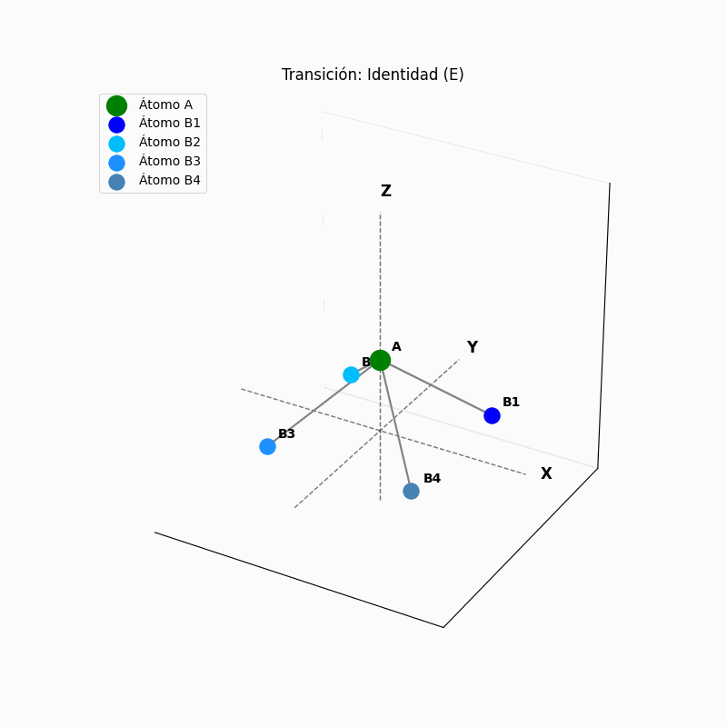

# Simulación AB4 Cómo Ejecutar el Proyecto

Este proyecto visualiza las operaciones de simetría de una molécula teórica AB₄ utilizando Matplotlib en Python. La animación muestra rotaciones y reflexiones con transiciones suaves para una mejor comprensión de los conceptos de simetría.

## Características

- **Visualización 3D**: Muestra la molécula AB₄ en un espacio tridimensional.
- **Operaciones de Simetría**:
  - Rotaciones progresivas (C4¹, C2 (C4²), C4³)
  - Reflexiones verticales (σv) y diagonales (σd)
- **Transiciones Suaves**: Animación fluida entre cada operación.
- **Ayudas Visuales**: Ejes, planos de simetría y etiquetas de átomos para mayor claridad.
- **Exportación a GIF**: Guarda la animación como un archivo GIF.

 **Clonar el repositorio:**
   ```bash
   git clone https://github.com/kebincontreras/QUANTUM_PHYSICS.git
   cd tu-repositorio
   ```

## Cómo Ejecutar el Proyecto

Simplemente haz doble clic en el archivo `run_project.bat`.

El script se encargará de:
1. Crear un entorno virtual llamado `quantum_symmetry`
2. Instalar las dependencias desde `requirements.txt`.
3. Ejecutar la simulación `A2_3.py`.

Al finalizar, la animación se mostrará en pantalla y se guardará como `simetria_AB4.gif`.
